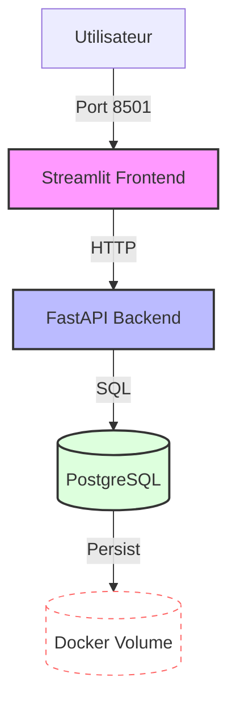

# Projet 2 : Orchestration, Sécurité et Livraison Continue

[](https://github.com/Roxiina/Projet-2/actions/workflows/ci.yml)
[](https://github.com/Roxiina/Projet-2/actions/workflows/security.yml)
[](https://github.com/Roxiina/Projet-2/actions/workflows/cd.yml)

Application complète de gestion de données avec architecture micro-services, orchestration Docker et CI/CD.

## 🚀 Fonctionnalités

- **Frontend Streamlit** : Interface utilisateur moderne et intuitive
- **API FastAPI** : Backend robuste avec documentation automatique
- **PostgreSQL** : Base de données relationnelle avec persistance
- **Docker Compose** : Orchestration complète des services
- **CI/CD** : Intégration et déploiement continus via GitHub Actions
- **Sécurité** : Scan automatique des secrets avec Gitleaks

## 📋 Prérequis

- Docker et Docker Compose
- Python 3.11+
- uv (gestionnaire de paquets Python)
- Git

## 🛠️ Installation et Démarrage

### Development (local avec build)

1. Clonez le repository :
```bash
git clone https://github.com/VOTRE_USERNAME/VOTRE_REPO.git
cd VOTRE_REPO
```

2. Créez un fichier `.env` à partir de `.env.example` :
```bash
cp .env.example .env
# Éditez .env avec vos valeurs
```

3. Lancez l'application avec Docker Compose :
```bash
docker-compose up -d
```

4. Accédez aux services :
- **Frontend** : http://localhost:8501
- **API** : http://localhost:8000
- **API Documentation** : http://localhost:8000/docs

### Production (images depuis DockerHub)

1. Assurez-vous d'avoir un fichier `.env` configuré

2. Modifiez votre fichier `.env` pour inclure votre nom d'utilisateur DockerHub :
```bash
DOCKERHUB_USERNAME=votre_username
```

3. Lancez avec le fichier de production :
```bash
docker-compose -f docker-compose.prod.yml up -d
```

## 🧪 Tests

### Tests de l'API

```bash
cd app_api
uv sync
uv run pytest tests/ -v --cov
```

### Linting

```bash
# API
cd app_api
uv run ruff check .

# Frontend
cd app_front
uv run ruff check .
```

## 📁 Structure du Projet

```
.
├── .github/
│   └── workflows/          # GitHub Actions CI/CD
│       ├── ci.yml         # Tests et linting
│       ├── security.yml   # Scan Gitleaks
│       └── cd.yml         # Déploiement DockerHub
├── app_api/               # Backend FastAPI
│   ├── maths/            # Modules mathématiques
│   ├── models/           # Modèles Pydantic
│   ├── modules/          # Logique métier (DB, CRUD)
│   ├── data/             # Données CSV
│   ├── tests/            # Tests unitaires
│   ├── main.py           # Point d'entrée API
│   ├── Dockerfile
│   └── pyproject.toml
├── app_front/            # Frontend Streamlit
│   ├── pages/           # Pages Streamlit
│   │   ├── 0_insert.py  # Page d'insertion
│   │   └── 1_read.py    # Page de lecture
│   ├── main.py          # Page d'accueil
│   ├── Dockerfile
│   └── pyproject.toml
├── docker-compose.yml        # Dev (avec build)
├── docker-compose.prod.yml   # Prod (avec images)
├── .env.example
├── .gitignore
└── README.md
```

## 🌐 Architecture



### Réseaux Docker

- **front-api** : Communication entre Streamlit et FastAPI
- **api-db** : Communication entre FastAPI et PostgreSQL

> ⚠️ La base de données n'est pas accessible directement depuis le frontend (isolation réseau)

## 🔒 Sécurité

- Variables d'environnement pour les secrets
- Scan automatique avec Gitleaks
- `.dockerignore` pour exclure les fichiers sensibles
- PostgreSQL isolé du frontend

## 🚢 CI/CD

### Workflow CI (ci.yml)
- Linting avec Ruff
- Tests avec Pytest
- Couverture de code
- Build Docker de test

### Workflow Security (security.yml)
- Scan Gitleaks pour détecter les secrets

### Workflow CD (cd.yml)
- Déclenchement automatique après CI réussie
- Build et push vers DockerHub avec tags :
  - `latest`
  - SHA du commit (pour rollback)

## 📦 Variables d'Environnement

Voir `.env.example` pour la liste complète. Principales variables :

- `POSTGRES_USER` : Nom d'utilisateur PostgreSQL
- `POSTGRES_PASSWORD` : Mot de passe PostgreSQL
- `POSTGRES_DB` : Nom de la base de données
- `API_URL` : URL de l'API (pour le frontend)

## 🤝 Contribution

Voir [CONTRIBUTING.md](CONTRIBUTING.md) pour les directives de contribution.

## 📄 Licence

Ce projet est un exercice pédagogique pour Simplon France.

## 👥 Auteurs

Projet réalisé dans le cadre de la formation Simplon France.

## 🆘 Support

Pour toute question ou problème, ouvrez une issue sur GitHub.
