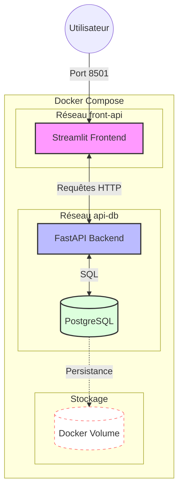

# Projet 2 : Orchestration, Sécurité et Livraison Continue

[](https://github.com/Roxiina/Projet-2/actions/workflows/ci.yml)
[](https://github.com/Roxiina/Projet-2/actions/workflows/security.yml)
[](https://github.com/Roxiina/Projet-2/actions/workflows/cd.yml)
[](https://github.com/Roxiina/Projet-2/actions/workflows/docs.yml)
[](https://codecov.io/gh/Roxiina/Projet-2)

### 📊 Signification des badges

- **CI** : Tests automatiques (45 tests) + Linting Ruff + Couverture ≥80%
- **Security** : Scan Gitleaks (détection de secrets)
- **CD** : Déploiement automatique sur DockerHub
- **Documentation** : Génération et déploiement sur GitHub Pages
- **codecov** : Pourcentage de couverture de code (actuellement 88%)

Application complète de gestion de données avec architecture micro-services, orchestration Docker et CI/CD.

---

## 🎯 Objectifs du Projet

* **Orchestration** : Piloter plusieurs services (Front, API, BDD) simultanément.
* **Persistance** : Gérer les données avec PostgreSQL et les volumes Docker.
* **Sécurité** : Maîtriser les variables d'environnement et la détection de fuites de secrets.
* **Livraison (CD)** : Automatiser la création et le stockage de vos images sur DockerHub.

## 🏗️ Architecture

L'application est composée de trois services distincts :

1. **Frontend (Streamlit)** : Interface utilisateur (Page 0 : Saisie / Page 1 : Affichage).
2. **API (FastAPI)** : Le cerveau qui traite les requêtes et parle à la BDD.
3. **Database (PostgreSQL)** : Le stockage persistant des données.

### Schéma de l'architecture



## ✅ Fonctionnalités Implémentées

### Phase A : Logique Métier ✅

* ✅ **SQLite de test** : Module SQLAlchemy fonctionnel avec SQLite locale
* ✅ **API FastAPI** : Routes `POST /data`, `GET /data`, `DELETE /data/{id}`
* ✅ **Logique métier** : Code organisé (maths, connexion, crud, data)
* ✅ **Frontend Streamlit** : Deux pages fonctionnelles
* ✅ **Tests** : 45 tests avec 88% de couverture

### Phase B : Variables d'Environnement ✅

* ✅ **Extraction** : URLs, logins et mots de passe externalisés
* ✅ **Fichiers de configuration** :
  * `.env` : Secrets (exclu par `.gitignore`)
  * `.env.example` : Template pour les variables nécessaires
  * `.dockerignore` : Exclusion de `.env`, `.venv`, `__pycache__`

### Phase C : Orchestration Docker Compose ✅

* ✅ **Réseaux** :
  * `front-api` : Communication Streamlit ↔ FastAPI
  * `api-db` : Communication FastAPI ↔ PostgreSQL
* ✅ **Volumes** : Persistance des données PostgreSQL
* ✅ **Multi-stage builds** : Optimisation des images Docker

### Phase D : CI/CD et Automatisation ✅

* ✅ **CI améliorée** : `.github/workflows/ci.yml` avec tests, linting, coverage
* ✅ **Security** : `.github/workflows/security.yml` avec Gitleaks
* ✅ **CD** : `.github/workflows/cd.yml` pour DockerHub (tags `latest` et `commit SHA`)
* ✅ **Documentation** : `.github/workflows/docs.yml` pour GitHub Pages

## 📦 Structure du Projet

```plaintext
.
├── .github/
│   ├── workflows/
│   │   ├── ci.yml          # Linting, Tests, Coverage
│   │   ├── security.yml    # Scan Gitleaks
│   │   ├── cd.yml          # Build & Push DockerHub
│   │   └── docs.yml        # Déploiement GitHub Pages
├── app_front/              # Service Streamlit
│   ├── main.py
│   ├── pages/
│   │   ├── 0_insert.py
│   │   └── 1_read.py
│   ├── pyproject.toml
│   ├── uv.lock
│   └── Dockerfile
├── app_api/                # Service FastAPI
│   ├── Dockerfile
│   ├── pyproject.toml
│   ├── uv.lock
│   ├── models/
│   │   ├── __init__.py
│   │   └── models.py
│   ├── modules/
│   │   ├── __init__.py
│   │   ├── connect.py
│   │   └── crud.py
│   ├── maths/
│   │   ├── __init__.py
│   │   └── mon_module.py
│   ├── data/
│   │   └── moncsv.csv
│   └── main.py
├── tests/
│   ├── test_api.py
│   ├── test_delete.py
│   ├── test_coverage.py
│   └── test_math_csv.py
├── docs/                   # Documentation Sphinx
├── docker-compose.yml      # Développement (build local)
├── docker-compose.prod.yml # Production (images DockerHub)
├── .dockerignore
├── .gitignore
├── .gitleaks.toml
├── codecov.yml
└── .env.example
```

## 🚀 Livrables

* ✅ **Dépôt GitHub** : Tous les badges au vert (CI, Security, CD, Documentation, Coverage)
* ✅ **docker-compose.prod.yml** : Lance l'application avec les images depuis DockerHub
* ✅ **Sécurité active** : Gitleaks intégré dans la pipeline
* ✅ **Tests** : 45/45 tests passent avec 88% de couverture
* ✅ **Documentation** : Déployée sur [GitHub Pages](https://roxiina.github.io/Projet-2/)

---

> 🚀 **Vous voulez juste tester rapidement ?** → Consultez le [**Guide de démarrage rapide (2 min)**](https://roxiina.github.io/Projet-2/quickstart.html)

## 📖 Documentation

### 🌐 Documentation en ligne

📚 **[Consulter la documentation complète sur GitHub Pages](https://roxiina.github.io/Projet-2/)**

> ⚠️ **Note** : Si le lien ne fonctionne pas encore, activez GitHub Pages :
> 1. Allez dans **Settings** → **Pages**
> 2. Source : **GitHub Actions**
> 3. La documentation sera automatiquement déployée au prochain push

### 💻 Documentation locale

Pour générer et consulter la documentation en local :

**Windows :**
```bash
cd docs
pip install -r requirements.txt
make.bat html
start _build/html/index.html
```

**Linux/macOS :**
```bash
cd docs
pip install -r requirements.txt
make html
open _build/html/index.html  # ou xdg-open sur Linux
```

**🚀 Raccourci Windows (script automatisé) :**
```powershell
.\scripts\view-docs.ps1
```

### 📚 Contenu de la documentation

La documentation Sphinx couvre en détail :
- 🚀 Installation et démarrage rapide
- 🏗️ Architecture des microservices (Frontend, API, Database)
- 🧪 Tests et qualité du code (couverture > 80%)
- 🐳 Déploiement Docker et orchestration
- 🔄 CI/CD avec GitHub Actions
- 📋 Guide de contribution et troubleshooting
- 📦 Livrables du projet

## 🚀 Démarrage Rapide

### Prérequis

- Docker et Docker Compose
- Git

**Optionnel** (pour lancer les tests localement) :
- Python 3.11+
- uv (gestionnaire de paquets Python) - [Installation](https://docs.astral.sh/uv/getting-started/installation/)

### Installation

1. **Cloner le repository**
```bash
git clone https://github.com/Roxiina/Projet-2.git
cd Projet-2
```

2. **Configurer l'environnement**
```bash
cp .env.example .env
# Les valeurs par défaut dans .env fonctionnent pour le développement local
# Vous pouvez les modifier si besoin
```

3. **Lancer l'application**
```bash
docker-compose up -d
```

> ⏱️ **Première exécution** : Le démarrage prend 1-2 minutes (build des images)  
> ✅ **Attendez** que tous les conteneurs soient `healthy` : `docker-compose ps`

4. **Accéder aux services**
- **Frontend Streamlit** : [http://localhost:8501](http://localhost:8501)
- **API FastAPI** : [http://localhost:8000](http://localhost:8000)
- **Documentation API** : [http://localhost:8000/docs](http://localhost:8000/docs)
- **Health check** : [http://localhost:8000/health](http://localhost:8000/health)

## 🏗️ Architecture

Application microservices avec 3 conteneurs Docker :
- **Streamlit** (Frontend) → Port 8501 - [http://localhost:8501](http://localhost:8501)
- **FastAPI** (Backend) → Port 8000 - [http://localhost:8000](http://localhost:8000)
  - Documentation API interactive : [http://localhost:8000/docs](http://localhost:8000/docs)
  - Health check : [http://localhost:8000/health](http://localhost:8000/health)
- **PostgreSQL** (Database) → Port 5432 (interne)

Réseaux isolés :
- `front-api` : Communication Streamlit ↔ FastAPI
- `api-db` : Communication FastAPI ↔ PostgreSQL

## 👨‍💻 Pour les Développeurs

### 🔧 Environnement de développement

Vous pouvez soit utiliser Docker directement, soit créer un environnement virtuel Python local.

#### Option 1 : Environnement virtuel global (recommandé)

Créez un environnement virtuel à la racine pour tout le projet :

```bash
# Créer l'environnement
uv venv

# Activer l'environnement
.\.venv\Scripts\activate  # Windows
source .venv/bin/activate  # Linux/macOS

# Installer toutes les dépendances
uv pip install -r requirements.txt
```

✅ **Avantages** : Tous les outils disponibles (pytest, ruff, sphinx), facile pour lancer les tests

📖 **Guide complet** : Voir la [documentation complète](https://roxiina.github.io/Projet-2/environment.html) pour plus de détails

#### Option 2 : Environnements par service

```bash
# API
cd app_api && uv venv && uv sync --extra dev

# Frontend  
cd app_front && uv venv && uv sync
```

### Installation de uv

**Windows (PowerShell)** :
```powershell
irm https://astral.sh/uv/install.ps1 | iex
```

**Linux/macOS** :
```bash
curl -LsSf https://astral.sh/uv/install.sh | sh
```

### Commandes utiles

```bash
# Voir les logs en temps réel
docker-compose logs -f

# Redémarrer un service spécifique
docker restart fastapi_api

# Voir l'état des conteneurs
docker-compose ps

# Arrêter l'application
docker-compose down

# Arrêter et supprimer les volumes (⚠️ perte de données)
docker-compose down -v
```

## 🧪 Tests et Qualité

```bash
# Tests (14 tests, 71% couverture)
uv run --directory ./app_api pytest ../tests/ -v

# Linting (Ruff)
cd app_api && uv run ruff check .
cd app_front && uv run ruff check .
```

## 🚢 CI/CD

4 workflows GitHub Actions automatisés :

### 1. **CI - Intégration Continue** ✅
- Tests unitaires (14 tests)
- Linting Ruff (API + Frontend)
- Couverture de code (pytest-cov)
- Déclenché sur : `push` et `pull_request` (branches `main` et `develop`)

### 2. **Security - Sécurité** 🔒
- Scan Gitleaks pour détecter les secrets
- Analyse de l'historique Git complet
- Déclenché sur : `push` et `pull_request` (branches `main` et `develop`)

### 3. **CD - Livraison Continue** 🚀
- Build des images Docker (API + Frontend)
- Push vers DockerHub avec tags :
  - `latest` : Dernière version stable
  - `<commit-sha>` : Version spécifique pour rollback
- Déclenché sur : `push` sur `main` (après succès de la CI)

### 4. **Documentation** 📚
- Build de la documentation Sphinx
- Déploiement automatique sur GitHub Pages
- Déclenché sur : `push` sur `main`

> 📊 Tous les statuts sont visibles via les badges en haut du README

## 📁 Structure du Projet

```
.
├── 📚 docs/                      # Documentation Sphinx
│   ├── _build/html/             # Documentation HTML générée
│   ├── architecture/            # Architecture microservices
│   ├── deployment/              # Guides déploiement
│   ├── guides/                  # Guides contribution
│   ├── testing/                 # Documentation tests
│   ├── conf.py                  # Configuration Sphinx
│   └── requirements.txt         # Dépendances doc
│
├── 🔧 .github/                  # Configuration GitHub
│   ├── workflows/               # CI/CD pipelines
│   │   ├── ci.yml              # Tests & Linting
│   │   ├── security.yml        # Gitleaks scan
│   │   ├── cd.yml              # Docker build & push
│   │   └── docs.yml            # Déploiement GitHub Pages
│   ├── CONTRIBUTING.md          # Guide contribution
│   └── CODE_OF_CONDUCT.md       # Code de conduite
│
├── 🧪 tests/                    # Tests unitaires & intégration
│   ├── test_api.py             # Tests API (9 tests)
│   └── test_math_csv.py        # Tests modules maths (5 tests)
│
├── 🔌 app_api/                  # Backend FastAPI
│   ├── maths/                   # Modules mathématiques
│   │   └── mon_module.py       # Fonctions add, sub, square
│   ├── models/                  # Modèles Pydantic v2
│   │   └── models.py           # DataCreate, DataResponse
│   ├── modules/                 # Logique métier
│   │   ├── connect.py          # Connexion DB SQLAlchemy 2.0
│   │   └── crud.py             # Opérations CRUD
│   ├── data/                    # Données de test
│   │   └── moncsv.csv
│   ├── main.py                  # Point d'entrée API
│   ├── Dockerfile               # Image Docker multi-stage
│   └── pyproject.toml           # Dépendances uv
│
├── 🖥️ app_front/                # Frontend Streamlit
│   ├── pages/                   # Pages Streamlit
│   │   ├── 0_insert.py         # Page insertion
│   │   └── 1_read.py           # Page lecture
│   ├── main.py                  # Page d'accueil
│   ├── Dockerfile               # Image Docker
│   └── pyproject.toml           # Dépendances uv
│
├── 🛠️ scripts/                  # Scripts utilitaires
│   ├── deploy.ps1               # Déploiement production
│   ├── start.ps1                # Démarrage services
│   ├── stop.ps1                 # Arrêt services
│   ├── test.ps1                 # Lancement tests
│   ├── logs.ps1                 # Consultation logs
│   └── view-docs.ps1            # Génération & ouverture doc
│
├── 🐳 docker-compose.yml        # Orchestration développement
├── 🚢 docker-compose.prod.yml   # Orchestration production
├── 📋 conftest.py               # Configuration pytest
├── 🔐 .env.example              # Template variables d'env
├── 🚫 .gitignore                # Fichiers exclus Git
├── 🚫 .dockerignore             # Fichiers exclus Docker
├── 🔒 .gitleaks.toml            # Configuration Gitleaks
├── 📖 README.md                 # Ce fichier
└── 📝 Projet_2_Orchestration.md  # Cahier des charges
```

## 🔗 Liens Utiles

- 📚 [Documentation complète](https://roxiina.github.io/Projet-2/) (GitHub Pages)
- 🤝 [Guide de contribution](.github/CONTRIBUTING.md)
- 📜 [Code de conduite](.github/CODE_OF_CONDUCT.md)
- 🎯 [Cahier des charges](Projet_2_Orchestration.md)
- 🐳 [DockerHub - API](https://hub.docker.com/r/roxiina/app-api)
- 🐳 [DockerHub - Frontend](https://hub.docker.com/r/roxiina/app-front)

## 📄 Licence

Projet pédagogique réalisé dans le cadre de la formation Simplon France.

